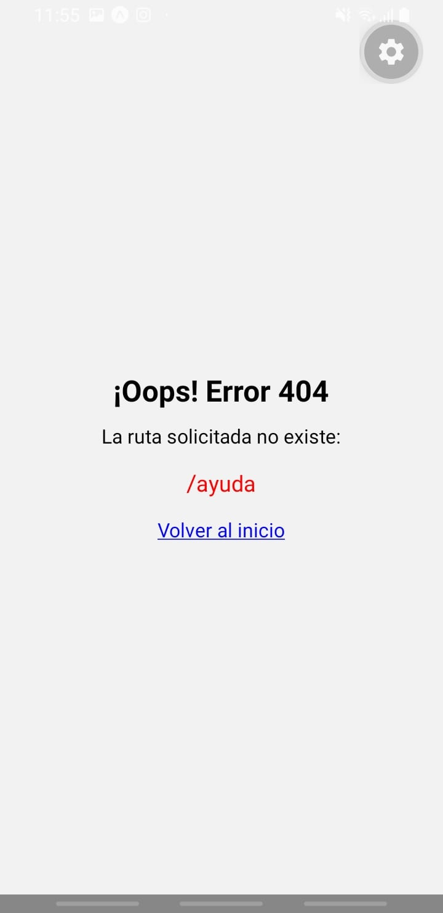

# Comedor IPF - App de Pedidos 

Aplicación desarrollada con Expo Router para la gestión de pedidos del comedor del Instituto Politécnico Formosa.

## 1. Árbol de Rutas y Layouts

A continuación se detalla la estructura de la carpeta `src/app` y los navegadores utilizados en cada `_layout.tsx`:

- **`src/app/_layout.tsx`**: Stack raíz. Contiene la configuración global, define las pantallas modales (`confirmar`, `login`) y protege la ruta `(cocina)`.
- **`src/app/(tabs)/_layout.tsx`**: Tabs (Pestañas). Maneja la navegación principal inferior entre `index` (Inicio), `menu` (Menú) y `carrito`.
- **`src/app/(tabs)/menu/_layout.tsx`**: Stack anidado. Permite navegar desde la lista de platos al detalle del plato manteniendo la barra de pestañas visible.
- **`src/app/(tabs)/carrito/_layout.tsx`**: Stack anidado. Mantiene la barra de pestañas visible mientras el usuario navega desde el resumen del carrito hacia la pantalla de notas (`/carrito/nota`).
- **`src/app/(cocina)/_layout.tsx`**: Drawer (Menú lateral). Panel exclusivo para los cocineros protegido mediante validación de sesión. Permite navegar entre la cola de pedidos pendientes y el historial de pedidos despachados.

## 2. Justificación de Navegación: `replace` VS `push`

En el flujo de confirmación de pedido (`/confirmar` -> `/turno/[numero]`), se decidió utilizar el método **`router.replace`** (combinado con el bloqueo de gestos nativos) en lugar de `push` para evitar que la pantalla de confirmación quede almacenada en la pila de navegación.

Si utilizáramos `push`, el usuario podría utilizar el gesto de deslizar o el botón de volver atrás del dispositivo para regresar a una pantalla de pago o confirmación donde el carrito ya fue procesado y vaciado. Al utilizar `replace`, modificamos el historial activo, lo que garantiza la integridad del estado, evita pedidos duplicados por accidentes de navegación y asegura un flujo unidireccional coherente.

## 3. Deep Link de Prueba

Para abrir un plato directamente en Expo Go desde la terminal o el navegador del celular, utilizar el siguiente enlace:
`comedoripf://menu/7`
_(Nota: El plato 7 corresponde a "Agua mineral" según nuestra base de datos local)._

## 4. Capturas de Pantalla

A continuación se demuestra el funcionamiento del sistema:

- **Pantalla 404 (Ruta inexistente):**
  

- **Carrito con funcionalidad de deshacer:**
  
https://github.com/user-attachments/assets/c13a5487-36d0-4894-8ee7-056a8b5e93a8

- **Turno asignado:**
  [Espacio para captura](./capturas/Turno%20asignado.jpeg)

- **Login / Logout de Cocina y atendiendo pedidos (Cola):**

https://github.com/user-attachments/assets/eb48bc42-d169-4809-b7c8-d686a7e18973

Aplicación desarrollada con Expo Router para la gestión de pedidos del comedor del Instituto Politécnico Formosa.
